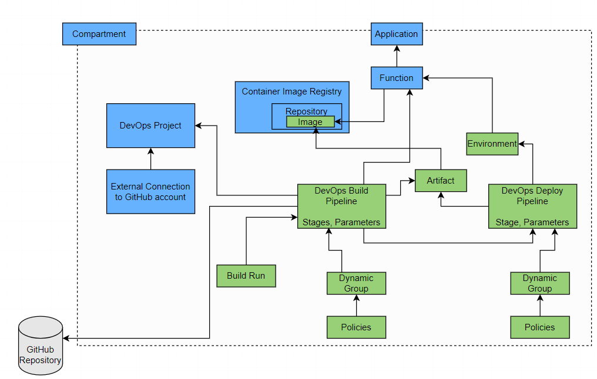

These Terraform plans are used to create a new DevOps build pipeline, a Deploy Pipeline that is triggered by the Build Pipeline, an artifact. 

The build and deploy pipeline process a Function - and therefore need to push a container image to the OCI Container Registry. Details for accessing this registry are required.

These plans can be executed most easily in the OCI Cloudshell (where Terraformm, the OCI Provide and the ~/.oci/config file are all available)

The OCI DevOps resources are created from the definitions in devops.tf. The file policies.tf defines the dynamic groups and IAM policies. In datasources.tf some Terraform resources used for querying the existing OCI resources. File provider.tf configures the OCI provider for Terraform and in variables.tf are the references that the user of this composite should specify: region and target compartment, name of DevOps project and external connection, name of application and function, the URL for the GitHub repository and the container image repository path in OCI Container Registry (everything before the function_name:image version)

The assumptions/prerequisites:
* the target compartment's OCID is specified in variables.tf
* a DevOps project already exists and its name is specified in variables.tf; its contains an external connection to a GitHub repository and its URL is also defined in variables.tf. 
* This pipeline builds and deploys a Function. This function already exists - as does the repository in the Container Image Registry. The names of the function and its application as well as the name of the container image repository are defined in the variables.tf file. Note: these resources can be produced using the OCI Terraform Composite *createDeployInvokeFunction*
* the user applying the Terraform plan has the required permissions to create the DevOps resources 

This diagram shows in green the resources that are created and in blue the resources that should exist ahead of creating the composite.
